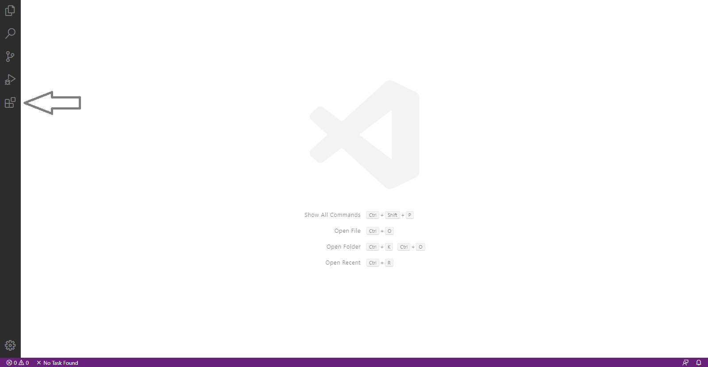

# PGHM-localisation-BTWF

Appareil de détection de signaux Wi-Fi et Bluetooth pour la location de victimes ensevelies en montagne utilisant un ESP32.

## Consignes d'utilisation de l'IDE

Pour développer le code des boîtiers, nous utilisons le framework `Arduino` grâce à l’environnement `PlatformIO`.

Pour simplifier son utilisation, nous l'utiliserons via son plug-in officiel dans l'IDE `Visual Studio Code`

### Installation
Premièrement, si vous ne la'avez pas déjà, il vous faudra installer `Visual Studio Code` à [cette adresse](https://code.visualstudio.com/download). (Attention, `Visual Studio Code` =/= `Visual Studio`)

Une fois `VSCode` installé, rendez-vous dans l'onglet `Extensions` pour installer `PlatformIO`.

Une fois l'extension installée, il vous suffit d'ouvrir le dossier du code en faisant `File -> Open folder`

Utilisez ensuite les boutons du bas pour `compiler` et `uploader` le programme sur la carte STM.

En cas de changement de carte ou autre, tous les paramètres du projet se trouvent dans le fichier `platformio.ini`. ([Documentation](https://docs.platformio.org/en/latest/projectconf/))

Si vous avez besoin d'aide sur autre-chose ou si vous avez des question quelconques, n'hésitez pas à me contacter (Farès Chati sur Facebook).